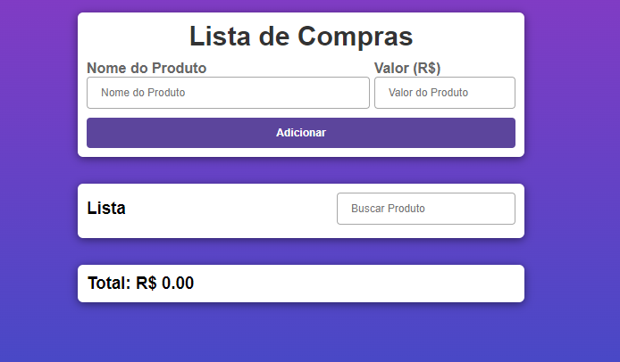

# índice

[Projeto- Criando um sistema de lista de compras](#projeto---criando-lista-de-compra)  
[Descrição](#descri%C3%A7%C3%A3o)  
[Introdução](#introdu%C3%A7%C3%A3o)  
[Funcionalidades](#funcionalidades)  
[Tecnologia utilizada](#tecnologia-utilizadas)  
[Fontes consultadas](#fontes-consultadas)  
[Autores](#autores)  

# projeto-lista 
Com base no exercício feito em sala, com utilização de Array, criamos um sistema que armazena um nome no Array e permite ainda realizar as operações de edição e exclusão, com isso iremos realizar um sistema de compras.

## Descrição 
O projeto de lista de compras é uma das melhores ferramentas para o usuário, e tem o intuito de ajudar o cliente a buscar e somar suas compras.

## Introdução
Ferramenta que auxilia o usuário com sua lista de compra.
O site foi criado para facilitar e ajudar os usuários com sua lista de compras de uma forma prática e fácil.

## Funcionalidade
Ao acessar o site o usuário será direcionado para a página inicial, lá irá aparecer as funções, sendo elas:
 - `Nome do produto`: O usuário terá que colocar o nome do produto desejado.
 - `Valor`: Essa campo será utilizado para adiconar o valor do produto.
 - `Lista`: Caso o usuário queira rever o valor do produto, é só digitar o nome que logo irá aparecer o produto.
- `Total`: Irá somar o valor total da compra(lista).

